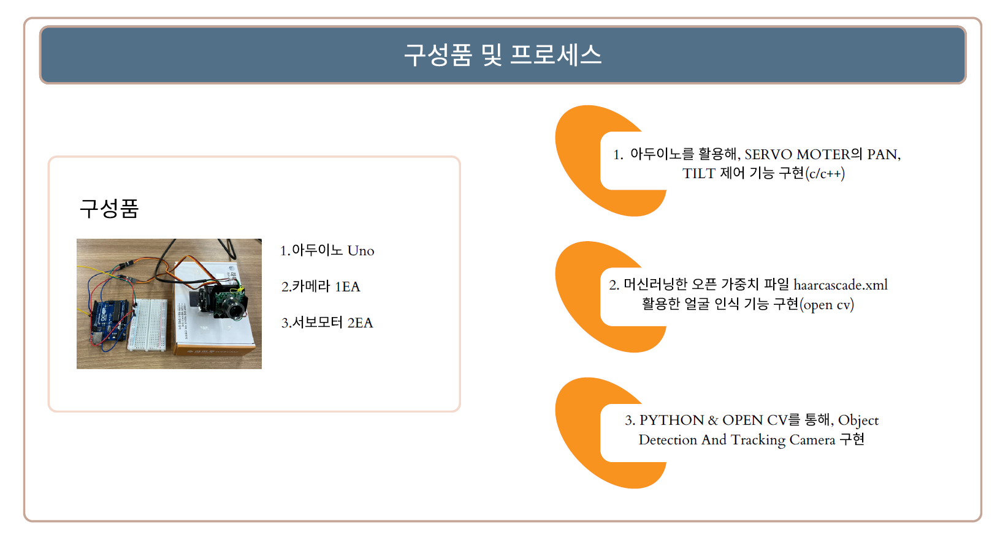
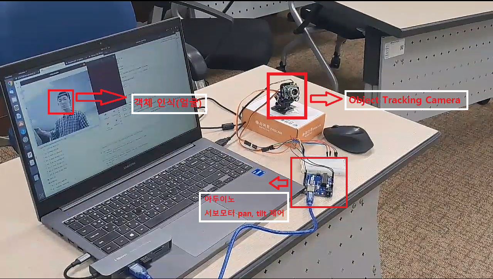

# Object-Detection-Tracking-Camera

 프로젝트명 : Object Detection Tracking Camera
 
수행기간
 2023. 10. 23 ~ 2023. 11. 24 (33일)

1) 목적 : 객체 인식을 통한 추적 카메라(보안, 감시용 카메라로 활용가능)
2) 개발 환경 : Python / Linux Ubntu/ C++/open cv
3) 주요 기능
1. 아두이노를 활용해, SERVO MOTER의 PAN, TILT 제어 기능 구현(c/c++)
- 시리얼 통신을 통해, 서보모터와 아두이노 연결
  
->Serial.begin(9600);

<'send_pan' 및 'send_tilt' 기능을 통해 전송된 직렬 통신 명령을 수신하고 해석할 수 있습니다. 이러한 기능은 직렬 통신을 통해 팬(수평 이동) 및 틸트(수직 이동)이 가능하게 함.>

-> 팬 움직임을 시리얼 통신으로 보내는 함수

def send_pan(pan):
    tx_dat = "pan" + str(pan) + "\n"
    sp.write(tx_dat.encode())
    print(tx_dat)

- 틸트 움직임을 시리얼 통신으로 보내는 함수

def send_tilt(tilt):
    tx_dat = "tilt" + str(tilt) + "\n"
    sp.write(tx_dat.encode())
    print(tx_dat)

2. 오픈 머신러닝 가중치 파일 haarcascade.xml을 활용한, 얼굴 인식 기능 구현
- 가중치 파일
cascade_filename = 'haarcascade_frontalface_alt.xml'
- 모델 불러오기
cascade = cv2.CascadeClassifier(cascade_filename)

3. python & open cv2를 통해, Object Detection And Tracking Camera 구현.

# 구성도

